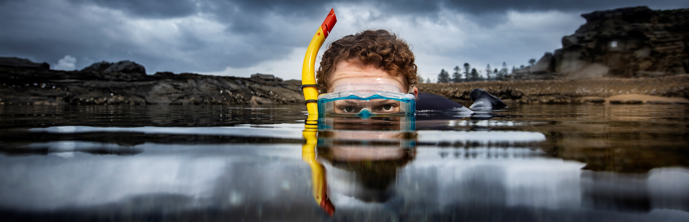
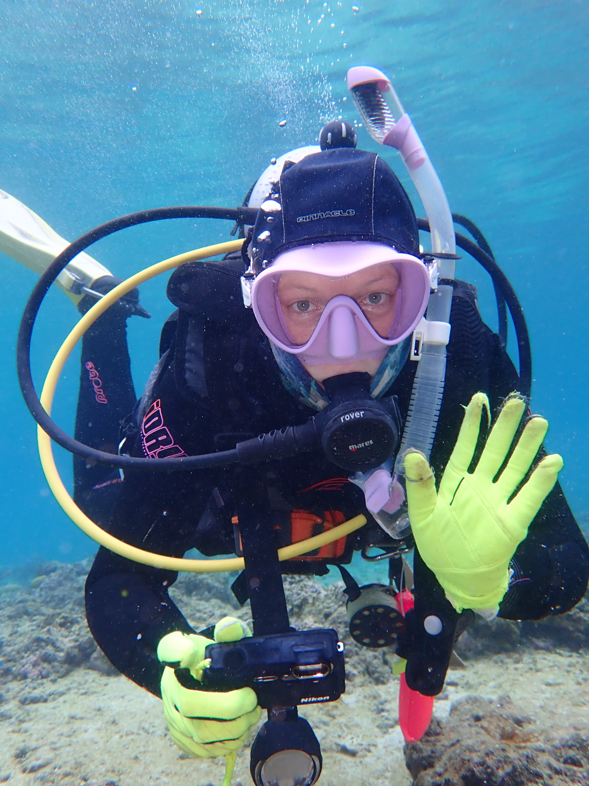

# **Welcome to Catheline Froehlich's Research**

Catheline is a marine ecologist that uses ecological and evolutionary approaches to uncover the functional relationships between organisms and their habitats. Catheline uses highly integrative approaches to study animal behaviour, fish coloration, environmental disturbances, global change, coral reefs, artificial reefs, mutualistic relationships, wildcat ecology, fish telemetry, and fisheries management. Follow her work and outreach on twitter @[gobyprincess](https://twitter.com/gobyprincess).

Catheline is currently a **postdoc** at the University of Alabama and Dauphin Island Sea Lab. There, she studies the mutualisms between anemonefish and anemones with Ben Titus. She was awarded a **National Science Foundation Postdoctoral Research Fellowship in Biology**!

She  completed her PhD at the University of Wollongong (UOW) and was also the first fellow to receive the Zoltan Florian Marine Biology Fellowship through the **Lizard Island Doctoral Fellowship Program** from the Australian Museum. She began studying the impacts of climate change on the symbiotic relationships between corals and coral-dwelling gobies. She was on the **Equity, Diversity, and Inclusion** committee for postgraduate students at UOW, and wants to continue removing systemic discrimination and barriers in research for all. Catheline completed her MSc at the University of Texas Rio Grande Valley while investigating the relationships between organisms and artificial reef habitats.

Catheline co-founded a few **podcasts** over the years, e.g. [Catch the Concept](https://open.spotify.com/show/6xOSwWJURzvU8S9qkgFjv6) and [The Graduates Sci-Com](https://open.spotify.com/show/7nwpzT5IpeH6cNgyJHaGVB?si=-WoJfjbJRHOnp4oTdoqL6w&nd=1) aimed at breaking down science concepts in fun and captivating ways. 

</a>

