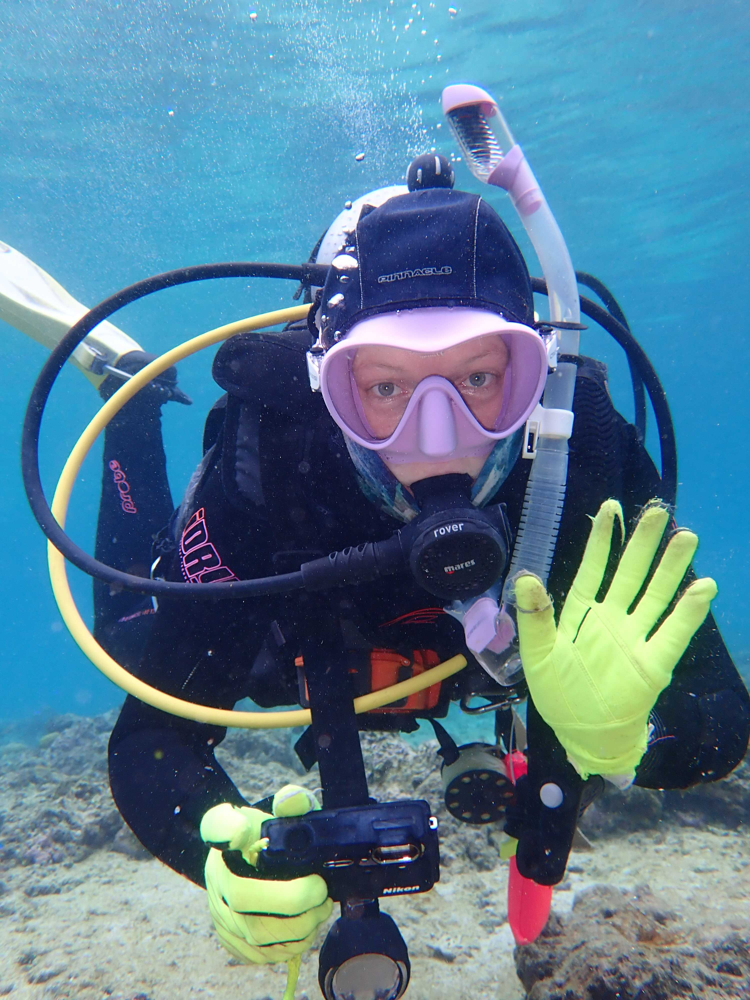
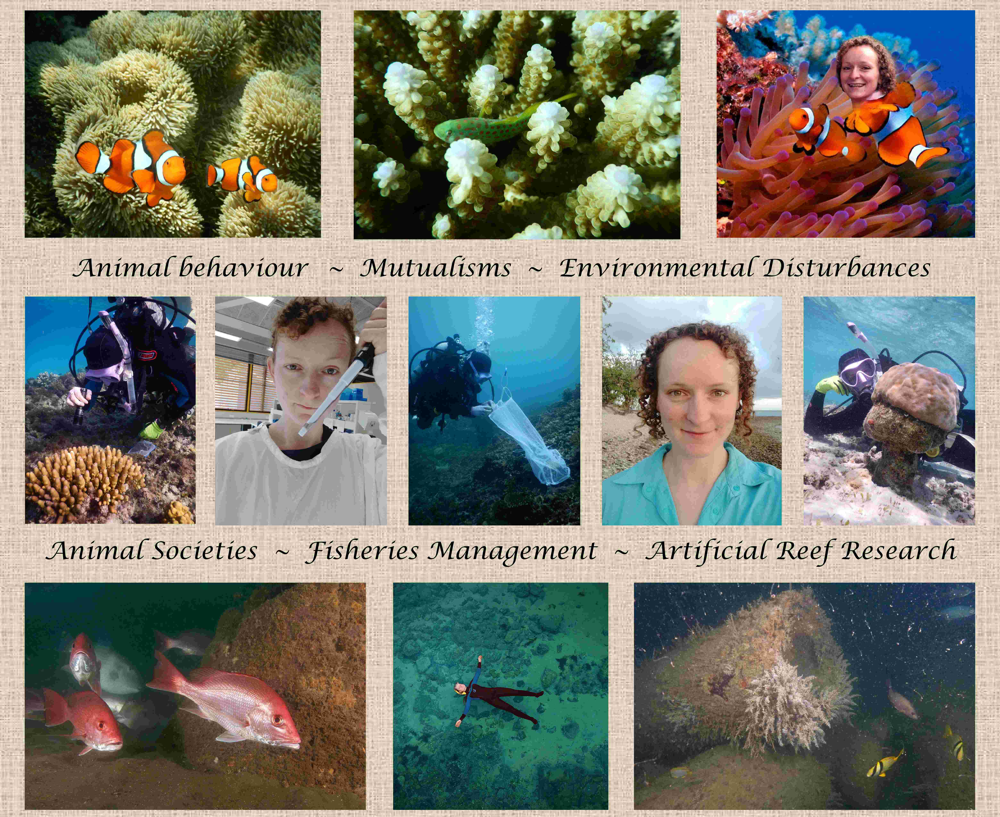

# **Welcome to Catheline Froehlich's Research**

Catheline uses ecological and evolutionary approaches to uncover the functional relationships between organisms, their behaviors, phenotypic traits, and environments. Via integrative methods, she studies aquatic interactions in light of environmental disturbances, global change, coral reefs, artificial reefs, mutualistic relationships, fish telemetry, and fisheries management.

Catheline is a **Research Assistant Professor** at Dauphin Island Sea Lab, where she studied primarily marine mutualisms between cnidarians and inverts and fishes. Catheline was a postdoc at the University of Alabama and Dauphin Island Sea Lab. There, she studied the mutualisms between anemonefish and anemones with Ben Titus. She was awarded a **National Science Foundation Postdoctoral Research Fellowship in Biology**!

Catheline co-founded a few **podcasts** over the years, and most recently [Catch the Concept](https://open.spotify.com/show/6xOSwWJURzvU8S9qkgFjv6) aimed at breaking down science concepts in fun and captivating ways. 

</a>

