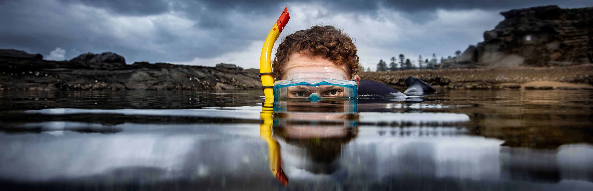
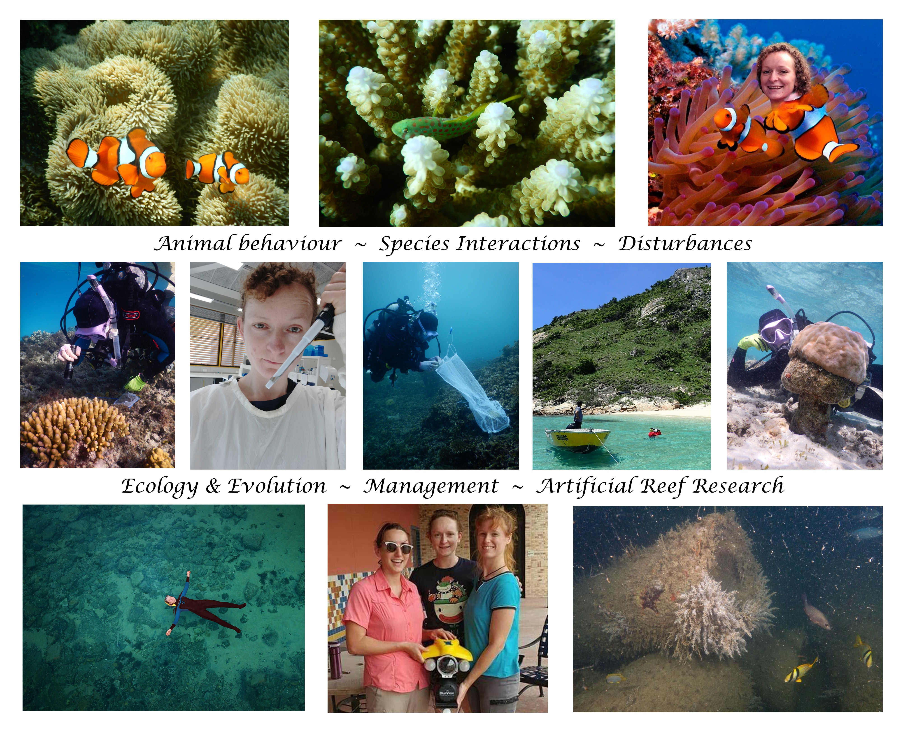

PI: Dr. Catheline Froehlich

We use **ecological and evolutionary approaches** to uncover the functional relationships between organisms, their behaviors, phenotypic traits, and environments. We primarily study marine mutualisms between inverts and fishes, but we also dabble in other types of **species interactions in the marine world**. 

We co-founded a few **podcasts** over the years, and most recently [Catch the Concept](https://open.spotify.com/show/6xOSwWJURzvU8S9qkgFjv6) aimed at breaking down science concepts in fun and captivating ways. 

Dr. Froehlich is an **Assistant Professor** at the University of Texas Rio Grande Valley. Previously, Dr. Froehlich completed a fantastic postdoc (awarded a **National Science Foundation Postdoctoral Research Fellowship in Biology**) with Dr. Ben Titus at the University of Alabama and Dauphin Island Sea Lab.

