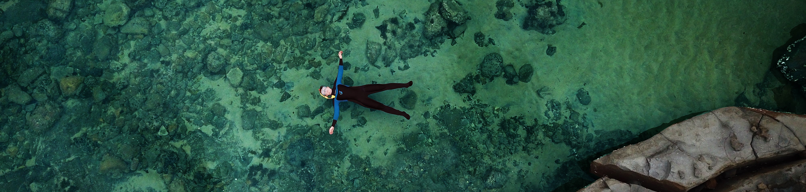

```{r setup, include=FALSE}
knitr::opts_chunk$set(message=FALSE,warning=FALSE, cache=TRUE)
```
# Academic Publications

14.. Titus. B.M., Froehlich, C.Y.M., Vondriska, C., Baker, R., Caves, E.M. In review. Stable isotopes disentangle niche partitioning and species co-occurrence in a multi-level marine mutualism.

13.. Froehlich. C.Y.M., Heatwole, S.J., Klanten, O.S., Hing, M.L., Hildebrandt, C.A., Smith, J.O., Wong, M.Y.L. In press. Multi-level framework to assess social variation in response to ecological and social factors: modeled with coral gobies. Oikos.

12.. [Kirby, R., Froehlich, C.Y.M., Greaves, S., Klanten, O.S., Wong, M.Y.L. Lack of population structure in an important fishery species of mud shrimp, Trypaea australiensis. Fish Manag Ecol. 00:e12682. doi: 10.1111/fme.12682.](https://onlinelibrary.wiley.com/doi/full/10.1111/fme.12682)

[11. Froehlich, C.Y.M., Klanten, O.S., Hing, M.L., Dowton, M., and Wong, M.Y.L. 2023. Delayed recovery and host specialization may spell disaster for coral-fish mutualism. Ecology and Evolution. 13(6): e10209. doi: 10.1002/ece3.10209.](https://onlinelibrary.wiley.com/doi/10.1002/ece3.10209)

[10. Froehlich, C.Y.M. 2022. What happens during a cyclone? The perspective of a reef fish. In: Coral Reefs of Australia: Hundred Years of Australian Coral Reef Society Science, Understanding the Fundamentals of Coral Reefs.](https://books.google.com/books/about/Coral_Reefs_of_Australia.html?id=MTKYEAAAQBAJ)

[9.	Froehlich, C.Y.M., Heatwole, S.J., Klanten, O.S., and Wong, M.Y.L. 2022. Habitat size, health and saturation do not alter movement decisions or the preference for familiarity in a social coral-reef fish. Animal Behaviour (impact factor:2.844, quartile 1 for ecology, evolution, behavior and systematics).](https://www.sciencedirect.com/science/article/pii/S0003347222001786?dgcid=author)

[8.	Froehlich, C.Y.M., Klanten, O.S., Hing, M.L., Dowton, M., and Wong, M.Y.L. 2021. Uneven declines between corals and cryptobenthic fish symbionts from multiple disturbances. Scientific Reports (impact factor 4.379, quartile 1). doi: 10.1038/s41598-021-95778-x.](https://www.nature.com/articles/s41598-021-95778-x#article-info)

[7.	Froehlich, C.Y.M., Lee, A., Oquita, R., Cintra-Buenrostro, C.E., and Shively, J.D. 2021. Reproductive characteristics of red snapper Lutjanus campechanus on artificial reefs in different jurisdictions. Regional Studies in Marine Science (impact factor 1.63) 47:101936. doi: 10.1016/j.rsma.2021.101936.](https://www.sciencedirect.com/science/article/abs/pii/S2352485521003285)

[6. 	Froehlich, C.Y.M., Garcia, A., Cintra-Buenrostro, C.E., Hicks, D.W., and Kline, R.J. 2021. Structural differences alter residency and depth patterns of red snapper (Lutjanus campechanus) at two artificial reefs. Fisheries Research (impact factor 1.874, quartile 1 for aquatic science) 242:106043. doi: 10.1016/j.fishres.2021.106043.](https://www.sciencedirect.com/science/article/abs/pii/S0165783621001715)

[5.	Rueger T., Branconi, R., Froehlich, C.Y.M., Heatwole, S.J., Wong, M.Y.L., and Buston, P.M. 2021. The next frontier in understanding the evolution of coral reef fish societies. Frontiers in Marine Science (impact factor 3.07, quartile 1 for aquatic science). 8:665780. doi: 10.3389/fmars.2021.665780.](https://www.frontiersin.org/articles/10.3389/fmars.2021.665780/full)

[4. 	Froehlich, C.Y.M., Garcia, A., and Kline, R.J. 2019. Daily movement patterns of red snapper (Lutjanus campechanus) on a large artificial reef. Fisheries Research (impact factor 1.874, quartile 1 for aquatic science) 209:49-57. doi: 10.1016/j.fishres.2018.09.006.](https://linkinghub.elsevier.com/retrieve/pii/S0165783618302418)

[3. 	Froehlich, C.Y.M., Lee, A., Oquita, R., Cintra-Buenrostro, C.E., Shively, J.D., and Shipley, J.B. 2018. A comparison of population dynamics from red snapper associated with inshore and offshore artificial reefs in the northwestern Gulf of Mexico. In: Bortone SA, editor. Marine artificial reef research and development: integrating fisheries management objectives. USA: Transactions of the American Fisheries Society (impact factor: 1.406, quartile 1 for aquatic science), 68.](https://www.researchgate.net/publication/329718111_A_comparison_of_population_dynamics_from_Red_Snapper_associated_with_inshore_and_offshore_artificial_reefs_in_the_northwestern_Gulf_of_Mexico)

[2.	Arney, R.N., Froehlich, C.Y.M., and Kline, R.J. 2017. Recruitment patterns of juvenile fish at an artificial reef in the Gulf of Mexico. Marine and Coastal Fisheries: Dynamics, Management, and Ecosystem Science (impact factor 1.177, quartile 1 for aquatic science). 9:79-92. doi: 10.1080/19425120.2016.1265031.](https://www.tandfonline.com/doi/full/10.1080/19425120.2016.1265031)

[1.	Froehlich, C.Y.M., and Kline, R.J. 2015. Using fish population metrics to compare the effects of artificial reef density. PLoS One (impact factor 2.806, quartile 1 for aquatic science). 10(9):e0139444. doi: 10.1371/journal.pone.0139444.](https://journals.plos.org/plosone/article?id=10.1371/journal.pone.0139444)

# Authored News Articles

[1. 	Froehlich, C., Wong, M., Klanten, O.S. September 2021. Photos from the field: why losing these tiny, loyal fish to climate change spells disaster for coral. The Conversation. https://theconversation.com/photos-from-the-field-why-losing-these-tiny-loyal-fish-to-climate-change-spells-disaster-for-coral-167119](https://theconversation.com/photos-from-the-field-why-losing-these-tiny-loyal-fish-to-climate-change-spells-disaster-for-coral-167119)

# Government White Papers

[8. Froehlich. C. April 2023. The ACRS comments on the Draft Policy of Fish Aggregating Devices and Artificial Reefs. Australian Coral Reef Society submission to the Great Barrier Reef MarinePark Authority.](https://australiancoralreefsociety.org/acrs-response-to-gbrmpas-draft-policy-of-fish-aggregating-devices-and-artificial-reefs/)

[7.	Froehlich, C., Goyen, S., Hoey, A. August 2020. The ACRS comments on revisions of AS/NZS scientific diving standards. Australian Coral Reef Society submission to the Standards Australia Diving Committee.](https://australiancoralreefsociety.org/library/submissions/)

[6.	Wolfe, K., & Froehlich, C. August 2020.The ACRS calls for a reassessment of the East Coast Sea Cucumber fishery. Australian Coral Reef Society submission to Department of Agriculture, Water and the Environment regarding Sea Cucumber Fishery (East Coast) – Status report for reassessment.](https://australiancoralreefsociety.org/the-acrs-calls-for-a-reassessment-of-east-coast-sea-cucumber-fishery/)

[5.	Suggett, D., Froehlich, C., Scott, A., Sims, C., Ricardo, G., Torda, G., Cumming, G., & Lewis, B. July 2020. The ACRS comments on the Draft Policy on Great Barrier Reef Interventions. Australian Coral Reef Society submission to the Great Barrier Reef Marine Park Authority.](https://australiancoralreefsociety.org/2251-2/)

[4.	Steinberg, R., Froehlich, C., & Turnbull, J. April 2020. Listing the Cauliflower Soft Coral (Dendronephthya australis) as an Endangered Species. Australian Coral Reef Society submission to the NSW Fisheries Scientific Committee.](https://australiancoralreefsociety.org/the-acrs-supports-listing-the-cauliflower-soft-coral-as-an-endangered-species/)

[3.	Hamylton, S., & Froehlich, C. December 2019. Great Barrier Reef outlook report highlights the urgent need to curb carbon emissions and improve water quality. Australian Coral Reef Society Reef Matters: ACRS commentary on the 2019 Great Barrier Reef Outlook Report.](https://australiancoralreefsociety.org/great-barrier-reef-outlook-report-highlights-the-urgent-need-to-curb-carbon-emissions-and-improve-water-quality/)

[2.	Froehlich, C. & Brodie, J. November 2019. The Great Barrier Reef needs evidence-based regulation of farm practices that impact water quality. Australian Coral Reef Society submission to the Senate Rural and Regional Affairs and transport References Committee.](https://australiancoralreefsociety.org/calling-for-evidence-based-regulation-of-farm-practices-that-impact-water-quality-in-the-great-barrier-reef/)

[1.	Fordyce, G., Goyen, S., & Froehlich, C. September 2019. Submission to the Australian Maritime Safety Authority on the proposed new Marine Order 505. Australian Coral Reef Society submission to the Australian Maritime Safety Authority.](https://australiancoralreefsociety.org/the-acrs-requests-that-exemption-15-be-retained-in-the-proposed-new-marine-order-505/)
